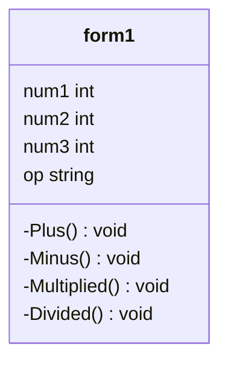

# Project643450334-3
ความเป็นมาของโปรแกรม
```
โปรแกรมเครื่องคิดเลขหรือเอาไว้คำนวณเลข สร้างขึ้นเพื่อต้องการที่จะทราบการคำนวณเลขพื้นฐานง่ายๆใช้ในชีวิตประจำวันของเรายังไงให้รวดเร็ว
```
วัตถุประสงค์ของโปรแกรม
```
1.เพื่อช่วยให้ตนเองคำนวณ หรือคิดเลขได้รวดเร็ว และแสดงจำนวณ บวก ลบ คูณ หาร ได้อย่างถูกต้อง
2.เพื่อที่จะสามารช่วยให้เราคล่อง เรื่องการคิดคำนวณเลข และเพื่อความสะดวกรวดเร็วมากขึ้น
```

Class Diagram

ผู้พัฒนาโปรแกรม
```
นางสาวอฆพร ไร่ขาม รหัสนักศึกษา 643450334-3
```
